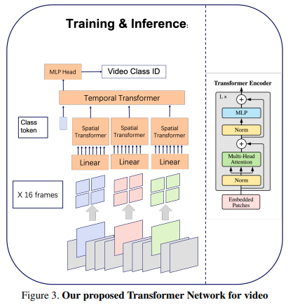

</img>

## STAM - Pytorch

Implementation of <a href="https://arxiv.org/abs/2103.13915">STAM (Space Time Attention Model)</a>, yet another pure and simple SOTA attention model that bests all previous models in video classification.

## Install

```bash
$ pip install stam-pytorch
```

## Usage

```python
import torch
from stam_pytorch import STAM

model = STAM(
    dim = 512,
    image_size = 256,     # size of image
    patch_size = 32,      # patch size
    num_frames = 5,       # number of image frames, selected out of video
    space_depth = 12,     # depth of vision transformer
    space_heads = 8,      # heads of vision transformer
    space_mlp_dim = 2048, # feedforward hidden dimension of vision transformer
    time_depth = 6,       # depth of time transformer (in paper, it was shallower, 6)
    time_heads = 8,       # heads of time transformer
    time_mlp_dim = 2048,  # feedforward hidden dimension of time transformer
    num_classes = 100,    # number of output classes
    space_dim_head = 64,  # space transformer head dimension
    time_dim_head = 64,   # time transformer head dimension
    dropout = 0.,         # dropout
    emb_dropout = 0.      # embedding dropout
)

frames = torch.randn(2, 5, 3, 256, 256) # (batch x frames x channels x height x width)
pred = model(frames) # (2, 100)
```

## Citations

```bibtex
@misc{sharir2021image,
    title   = {An Image is Worth 16x16 Words, What is a Video Worth?}, 
    author  = {Gilad Sharir and Asaf Noy and Lihi Zelnik-Manor},
    year    = {2021},
    eprint  = {2103.13915},
    archivePrefix = {arXiv},
    primaryClass = {cs.CV}
}
```
